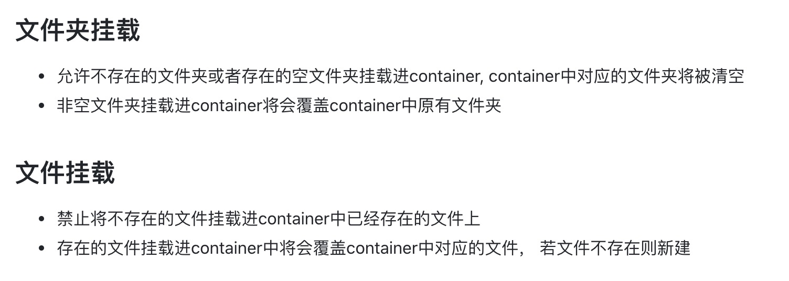
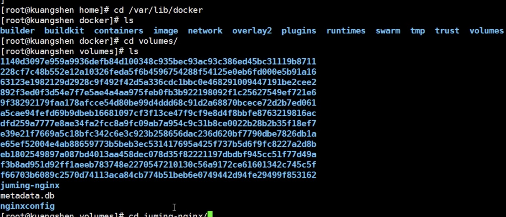
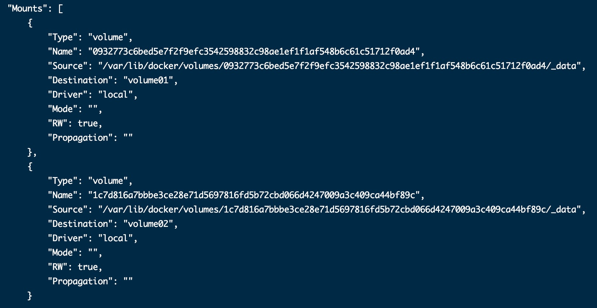
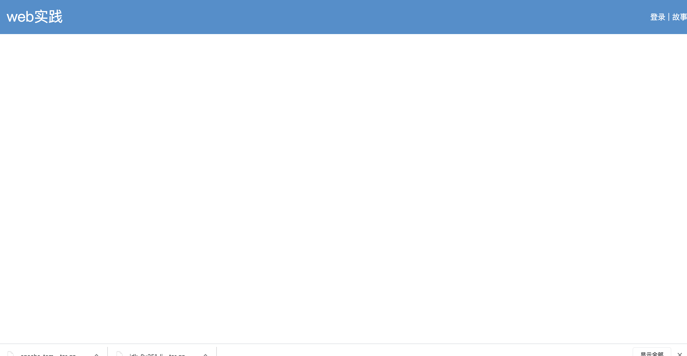

##1.容器数据卷##

容器的持久化和同步操作；容器和宿主机之间数据共享

```
docker -it -v /home/ceshi:/home centos /bin/bash  双向绑定
```
a.测试：持久化mysql

**注意**


因为是宿主机映射容器，先将要挂载的文件从或文件夹从容器中拷贝到宿主机，再进行挂载

1.1 指定路径挂载
 ```
 docker run -d -p 3306:3306 -v /data/mysql/conf:/etc/mysql/conf.d -v /data/mysql/data:/var/lib/mysql -e MYSQL_ROOT_PASSWORD=123456 --name mysql02 mysql
 ```

1.2 具名挂载 

```
docker run -d -P --name nginx02 -v juming:/etc/nginx nginx
```


1.3 匿名挂载	

```
docker run -d -P --name nginx03 -v /etc/nginx
```

```
docker volume ls  //查看所有卷的情况

docker volume inspect juming //查看这个卷

docker run -d -P --name nginx02 -v juming:/etc/nginx:ro nginx  //只读权限 只能在宿主机修改文件

docker run -d -P --name nginx02 -v juming:/etc/nginx:rw nginx

```
卷的位置



##2.数据卷容器
实现容器之间的数据挂载 互为主从

```
 docker run -it --name docker01  centos_xt:1.0.0  /bin/bash    //启动一个容器

 docker run -it --name docker02  --volumes-from docker01 centos_xt:1.0.0  /bin/bash            //启动另一个容器，数据卷挂载在容器01的数据卷上 

```

##3.Dockerfile##

就是用来构建docker镜像的构建文件！

```
touch dockerfile //创建文件，名字最好是dockerfile

FROM centos
VOLUME ["volume01","volume02"]
CMD echo "----end----"
CMD /bin/bash

docker build -f dockerfile -t centos_xt .   //别拉下这个.

docker inspect 容器id
```
匿名挂载


**指令**

```
FROM     			# 基础镜像 一切从这里构建 centos
MAINTAINER		# 镜像的作者  姓名+邮箱
RUN 				# 镜像构建的时候需要运行的命令
ADD					# 步骤 添加内容 如 tomcat镜像
WORKDIR			# 镜像的工作目录
VOLUME 			# 挂载的目录
EXPOSE				# 保留端口配置
CMD					# 指定容器启动的时候运行的命令，只有最后一个生效，会被代替 
ENTRYPOINT		# 指定容器启动的时候运行的命令，可以追加 
ONBUILD			# 当构建一个被继承的dockfile时，就会运行ONBUILD的指令
COPY				# 相当于 ADD，将文件拷贝到镜像中
ENV					# 构建的时候设置环境变量
```


自己打包一个centos镜像，完善命令

```
FROM centos
MAINTAINER xtuao<guangyan0011@gmail.com>
ENV MYPATH /usr/local
WORKDIR $MYPATH
RUN yum -y install vim
RUN yum -y install net-tools
EXPOSE 80
CMD echo $MYPATH
CMD echo "----end----"
CMD /bin/bash


```

```
docker history 镜像id    //查看镜像的构建过程

```

**通过dockerfile构建自己的镜像**

```
1.导出镜像：在根目录下
docker save <myimage>:<tag> | gzip > <myimage>_<tag>.tar.gz
2.导入镜像：
gunzip -c <myimage>_<tag>.tar.gz | docker load


1.先准备jdk 和 tomcat的压缩包，去各自的官网去下载

2.编写dockerfile
FROM centos
MAINTAINER xutao<guangyan0011@gmail.cm> 
ADD  jdk-8u251-linux-x64.tar.gz   /usr/local/
ADD  apache-tomcat-9.0.37.tar.gz    /usr/local/ 
RUN yum -y install vim 
ENV MYPATH /usr/local 
WORKDIR $MYPATH 
ENV JAVA_HOME /usr/local/jdk1.8.0_251
ENV CLASSPATH $JAVA_HOME/lib/dt.jar:$JAVA_HOME/lib/tools.jar 
ENV CATALINA_HOME /usr/local/apache-tomcat-9.0.37
ENV CATALINA_BASH /usr/local/apache-tomcat-9.0.37
ENV PATH $PATH:$JAVA_HOME/bin:$CATALINA_HOME/lib:$CATALINA_HOME/bin 
EXPOSE 8080 
CMD /usr/local/apache-tomcat-9.0.37/bin/startup.sh && tail -F /usr/local/apache-tomcat-9.0.37/bin/logs/catalina.out


3.构建
docker build -f dockerfile -t mydocker .

4.启动
docker run -d -p 3304:8080 --name mydocker02 -v /data/mydocker/test:/usr/local/apache-tomcat-9.0.37/webapps/test -v /data/mydocker/logs:/usr/local/apache-tomcat-9.0.37/logs mydocker

5.在宿主机的test文件夹下新建WEB-INF 文件夹，
新建文件web.xml
<web-app version="2.4" 
    xmlns="http://java.sun.com/xml/ns/j2ee" 
    xmlns:xsi="http://www.w3.org/2001/XMLSchema-instance"
    xsi:schemaLocation="http://java.sun.com/xml/ns/j2ee 
        http://java.sun.com/xml/ns/j2ee/web-app_2_4.xsd">
</web-app>
新建文件index.jsp
<%@ page language="java" contentType="text/html; charset=utf-8"
    pageEncoding="utf-8"%>
<!DOCTYPE html PUBLIC "-//W3C//DTD HTML 4.01 Transitional//EN" "http://www.w3.org/TR/html4/loose.dtd">
<html>
<head>
<meta http-equiv="Content-Type" content="text/html; charset=utf-8">
<title>首页</title>
<style>
    *{
    padding:0;
    margin:0;
    font-family:"微软雅黑";
}
.header{
    height:72px;
    background:#458fce ;
}
.header .logo{
    color:#fff ;
    line-height:70px;
    font-size:30px;
    margin-left:20px;
    display:inline-block;
    text-align:center;

}
a {
    color: #fff ;
    text-decoration: none ;
}
.header .login{
    float:right;
    color:#fff ;
    line-height:72px;
    margin-right:2px;
    display:inline-block;
}
.banner{
    height:380px;
    overflow:hidden;
    background: #ddd;
}
</style>
</head>
<body>
    <div class="header">
        <div class="logo">web实践</div>
        <div class ="login">
            <a href ="javascript:void(0)">登录</a>
            <span>|</span> 
            <a href ="javascript:void(0)">故事</a>
        </div>
    </div>
</body>
</html>


```
效果如图 http://49.235.157.108:3304/test/



